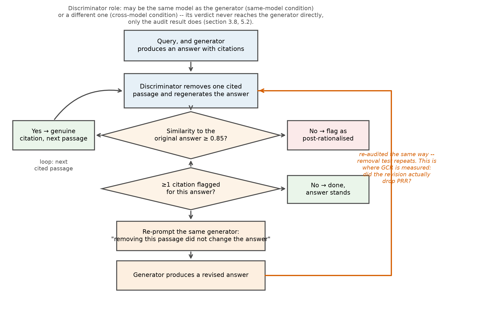

# Correcting Post-Rationalised Citations in Retrieval-Augmented Generation

### *A causal feedback loop and the generator property it makes visible*

**MSc Thesis — Computer Science, Big Data and Artificial Intelligence**
SRH Berlin University of Applied Sciences, 2026
Author: **Srihari Ananthan** · Supervisors: Prof. Dr. Joel Dokmegang (SRH Berlin), Maximilian Erdmann Sanchez (Startup Insider GmbH)

<p align="center">
  
</p>

---

## Abstract

Retrieval-augmented generation (RAG) systems have a known failure mode called
**post-rationalisation**: the model answers from its own memory first, then attaches a
citation that merely *looks* relevant rather than one it actually relied on. Existing
evaluation frameworks only measure this after the fact.

This thesis asks whether the same removal test used to *detect* post-rationalisation can
also be used to *correct* it during generation. A cited passage is deleted from the
context and the answer is regenerated; if the answer barely changes, the citation was
decorative — that verdict is then fed back to the generator as a correction signal, and
the generator is asked to revise.

Across 75 evaluation queries, 38,692 DACH-region company profiles, three generator
models, three discriminator models, and twelve experimental conditions, the correction
loop's effect turned out to depend entirely on *which model* answers:

| | Post-rationalisation drop | Significance |
|---|---|---|
| **Mistral 7B** | −12.8 pp (22.2% → 9.4%) | *p* = 0.0012, survives Bonferroni correction |
| **Llama 3 8B** | −6.4 pp (20.6% → 14.1%) | *p* = 0.032, nominal only |
| **Gemini 2.5 Flash** | no measurable change | — |

A new property — **generator correction receptivity (GCR)** — quantifies how much a
model actually acts on a correction signal once one is sent: it ranges from 14.8% to
59.1% across the three models studied, in the same rank order as the post-rationalisation
drop itself. Separately, LLMs asked to judge post-rationalisation verbally (without
running the causal test) caught only 8.5% of flagged cases — a causal audit outperforms
a language model's own judgment of its citations.

---

## Repository contents

This is a **curated public copy** of the working project. The private repository (full
commit history and the proprietary Startup Insider company database used as the
retrieval corpus) stays private, because that corpus is licensed third-party data and
cannot be redistributed. Everything else — every line of pipeline, audit, correction-loop
and analysis code; every aggregated result; the full reference list *and* the reference
papers themselves; every thesis draft figure; and the thesis document — is here.

| Path | Contents |
|---|---|
| `pipeline/` | Retrieval and baseline answer generation |
| `audit/` | The chunk-removal audit and cosine-similarity scoring |
| `adversarial/` | The correction (re-prompting) loop and the discriminator |
| `models/` | Model client wrappers (Gemini, Ollama) |
| `evaluation/` | Metrics, significance testing, threshold sensitivity, survey/annotation tooling |
| `scripts/` | Experiment runners |
| `ui/`, `ingestion/` | Supporting demo app and corpus ingestion code |
| `document/` | Thesis build tooling (docx/figure generation, citation/style checks) |
| `document/figures/` | Every figure used in the thesis, as generated by `document/build_figures.py` |
| [`document/CORPUS_SAMPLE.md`](document/CORPUS_SAMPLE.md) | 5 real company profiles spanning the corpus's actual length range |
| `document/refs/` | The bibliography (49 references) and citation-verification tooling |
| `reference_papers/` | Full text of 46 of the 49 cited papers — all open-access arXiv preprints |
| `experiments/results/` | Aggregated, per-condition and per-query results for every experiment round |
| `data/queries/` | The 75 evaluation queries (proprietary ground-truth company fields removed) |
| `thesis/` | The complete thesis document |

## Method, in brief

1. **Corpus.** 38,692 DACH-region (Germany, Austria, Switzerland) startup profiles, each
   treated as a single retrievable, citeable chunk — deliberately not split into
   fixed-size windows, so that a citation always names exactly one company.
2. **Audit.** For each citation in a generated answer, the cited passage is removed and
   the answer regenerated. If the cosine similarity between the original and regenerated
   answer is ≥ 0.85, the citation is classified as post-rationalised.
3. **Correction loop.** When the audit flags a post-rationalised citation, that verdict
   is sent back to the generator as feedback, and the generator revises its answer. The
   audit is re-run on the revision.
4. **Design.** Twelve conditions (three generators × three discriminators, plus a
   no-discriminator baseline per generator), each run against all 75 queries at sampling
   temperature zero for determinism.

Full methodology, including the reasoning behind every design choice, is in
[`thesis/Thesis_Srihari_Ananthan.docx`](thesis/Thesis_Srihari_Ananthan.docx), Chapter 3.

## Running the code

```bash
python3 -m venv .venv && source .venv/bin/activate
pip install -r requirements.txt
```

Requires **Python 3.11+**. The audit, correction-loop, and evaluation code is
self-contained and will run against any document corpus in the same shape (short,
structured, citeable text chunks) — point `pipeline/` and `ingestion/` at your own data
to reproduce the method end to end.

Reproducing *this thesis's exact numbers* additionally requires the private company
corpus and the raw per-query experiment logs, neither of which is redistributable — the
scripts under `evaluation/` (`analyse_v7.py`, `threshold_sensitivity.py`, and the
`build_*.py` table generators) are exactly what produced every number and table in the
thesis, and are included so the method is fully auditable, but they read from those raw
logs. The **aggregated output of every one of those scripts is already committed** under
`experiments/results/`, so nothing needs to be re-run to see the results themselves.

## Reference papers

`reference_papers/` contains the full text of 46 of the 49 works cited in the thesis, all
legitimately open-access arXiv preprints (details in
[`reference_papers/DOWNLOAD_REPORT.md`](reference_papers/DOWNLOAD_REPORT.md), though note
that file predates some later additions to the bibliography). The remaining 3 — Cohen
(1960), Landis & Koch (1977), and Cohen (1988) — are a paywalled journal article, a
paywalled JSTOR-hosted article, and a book, none with a legitimate open-access copy;
they're cited by reference only, in
[`document/refs/references.yaml`](document/refs/references.yaml), but not redistributed
here.

## License

Code is released under the [MIT License](LICENSE). The thesis document itself remains
© Srihari Ananthan — code reuse is welcomed and encouraged; if you're citing the thesis's
findings, please cite the thesis directly.

## Citation

```
Ananthan, S. (2026). Correcting Post-Rationalised Citations in Retrieval-Augmented
Generation: A causal feedback loop and the generator property it makes visible.
Master's thesis, SRH Berlin University of Applied Sciences.
```
